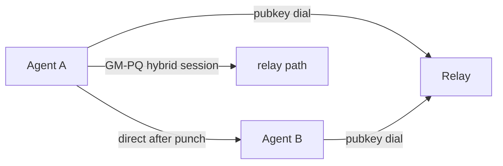

# Directwire

**Public-key native networking for autonomous agents.**

Directwire is an open protocol and reference implementation for direct, encrypted, server-independent communication between AI agents. **Dial by public key, not by IP.**

Today's agents are chained to central brokers and cloud relays. Directwire gives every agent a home address that cannot be taken away — a cryptographic identity, a direct path when one exists, and a secure fallback when NAT blocks the way.

## Why Directwire

- **Identity is the address.** Peers are dialed by their ed25519 node ID. No IP, no DNS, no central registry that can revoke you.
- **Encrypted by default, hybrid-hardened.** Sessions use a hybrid of national-crypto (SM2) and post-quantum (ML-KEM-768) key encapsulation — break one, the other still holds.
- **Direct when possible, relayed when not.** NAT hole punching establishes a peer-to-peer path; a relay guarantees liveness as a fallback.
- **Adaptive paths.** Route selection weighs RTT and loss with hysteresis — no flapping under real-world jitter.
- **Forward secrecy, replay protection, key hygiene.** Ephemeral keys, sliding replay windows, and zeroize on every secret.

## Status

**Research preview (v0.2).** The protocol is under active design; the reference implementation is a clean-room architecture-validation baseline, now covering the full five-layer stack (see [the architecture whitepaper](docs/architecture-whitepaper.md)). SemVer will not be meaningful until v1.

## Workspace

Five crates, one wire — from the cryptographic handshake up to the edge gateway:

| crate | layer | role |
|---|---|---|
| [`gm-pq-stack`](crates/gm-pq-stack) | Security | Hybrid national-crypto + post-quantum secure channel: SM2 + ML-KEM-768 handshake, SM4-GCM sessions, replay protection, cookie anti-DoS, 0-RTT resumption |
| [`p2p-mesh`](crates/p2p-mesh) | Connectivity | iroh-style public-key mesh networking: relay brokering, NAT hole punching, QUIC simultaneous-open direct, adaptive path selection, MCP server |
| [`moq-live`](crates/moq-live) | Media | MoQ-lite low-latency live transport: publish/subscribe, stream-per-group, priority-aware drop, catch-up |
| [`homa-rpc`](crates/homa-rpc) | RPC | Homa-style message-oriented transport over UDP + idempotent RPC: SRPT grant scheduling, 8-level QoS |
| [`xdp-edge`](crates/xdp-edge) | Edge | eBPF/XDP edge data plane: per-source rate limiting, SYN-flood detection, Maglev L4 load balancing, IPIP forwarding |

## Quickstart

```bash
# run all workspace tests (both crates)
cargo test --workspace --all-features

# three-process mesh demo (see crates/p2p-mesh/README.md)
cargo run -p p2p-mesh --example relay -- --port 9100
cargo run -p p2p-mesh --example node_b -- --relay 127.0.0.1:9100 --seed 2
cargo run -p p2p-mesh --example node_a -- --relay 127.0.0.1:9100 --peer <node-b-hex>
```

## End-to-end demo

One command starts a relay + two nodes on your machine, watches them establish a relay session,
punch a direct path, and switch: `scripts/demo.sh` (or `scripts/demo.sh --gm-pq` to also enable the
SM2 + ML-KEM-768 channel). The script prints both nodes' event streams; the line to look for is
`*** path switch Relay -> Direct ***` — after it, messages flow over the direct QUIC path instead of the relay.

## Architecture



## Docs

- [Protocol specification](SPEC.md)
- [Protocol deep-dive: design rationale](docs/protocol-deep-dive.md)
- [Architecture whitepaper: the five-layer stack](docs/architecture-whitepaper.md)
- [Security considerations](SPEC.md#security-considerations)
- [p2p-mesh README](crates/p2p-mesh/README.md) · [moq-live README](crates/moq-live/README.md) · [homa-rpc README](crates/homa-rpc/README.md) · [xdp-edge README](crates/xdp-edge/README.md)
- [gm-pq-stack README](crates/gm-pq-stack/README.md)
- [Integrating the crypto stack](crates/gm-pq-stack/docs/INTEGRATION.md)
- [Changelog](CHANGELOG.md) · [Governance](GOVERNANCE.md)
- [Security policy](SECURITY.md)
- [Contributing](CONTRIBUTING.md) · [Code of Conduct](CODE_OF_CONDUCT.md)

## License

Dual-licensed under **Apache-2.0** or **MulanPSL-2.0** — you may choose either.
Both are OSI-approved permissive licenses and mutually compatible; Mulan PSL
v2 is the license of record for the Chinese national-crypto ecosystem
(OpenEuler / OpenGauss family), keeping the hybrid SM2 + ML-KEM-768 stack
integratable into domestic commercial-cryptography deployments.

- [LICENSE](LICENSE) — Apache License 2.0
- [LICENSE-MULANPSL-2.0](LICENSE-MULANPSL-2.0) — 木兰宽松许可证 第2版 (Mulan PSL v2)
