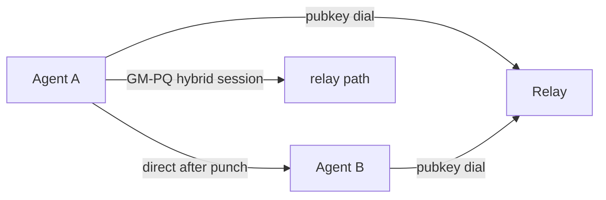

# Directwire

**Public-key native networking for autonomous agents.**

Directwire is an open protocol and reference implementation for direct, encrypted, server-independent communication between AI agents. **Dial by public key, not by IP.**

Today's agents are chained to central brokers and cloud relays. Directwire gives every agent a home address that cannot be taken away — a cryptographic identity, a direct path when one exists, and a secure fallback when NAT blocks the way.

## Why Directwire

- **Identity is the address.** Peers are dialed by their ed25519 node ID. No IP, no DNS, no central registry that can revoke you.
- **Encrypted by default, hybrid-hardened.** Sessions use a hybrid of national-crypto (SM2) and post-quantum (ML-KEM-768) key encapsulation — break one, the other still holds.
- **Direct when possible, relayed when not.** NAT hole punching establishes a peer-to-peer path; a relay guarantees liveness as a fallback.
- **Adaptive paths.** Route selection weighs RTT and loss with hysteresis — no flapping under real-world jitter.
- **Forward secrecy, replay protection, key hygiene.** Ephemeral keys, sliding replay windows, and zeroize on every secret.

## Status

**Research preview (v0.1).** The protocol is under active design; the reference implementation is a clean-room architecture-validation baseline. SemVer will not be meaningful until v1.

## Workspace

Two crates:

| crate | role |
|---|---|
| [`gm-pq-stack`](crates/gm-pq-stack) | Hybrid national-crypto + post-quantum transport: SM2 + ML-KEM-768 hybrid handshake, SM4-GCM sessions, replay protection, cookie anti-DoS, 0-RTT resumption |
| [`p2p-mesh`](crates/p2p-mesh) | iroh-style public-key mesh networking: relay brokering, NAT hole punching, QUIC simultaneous-open direct, adaptive path selection |

## Quickstart

```bash
# run all workspace tests (both crates)
cargo test --workspace --all-features

# three-process mesh demo (see crates/p2p-mesh/README.md)
cargo run -p p2p-mesh --example relay -- --port 9100
cargo run -p p2p-mesh --example node_b -- --relay 127.0.0.1:9100 --seed 2
cargo run -p p2p-mesh --example node_a -- --relay 127.0.0.1:9100 --peer <node-b-hex>
```

## Architecture



## Docs

- [Protocol specification](SPEC.md)
- [Security considerations](SPEC.md#security-considerations)
- [p2p-mesh README](crates/p2p-mesh/README.md)
- [gm-pq-stack README](crates/gm-pq-stack/README.md)
- [Integrating the crypto stack](crates/gm-pq-stack/docs/INTEGRATION.md)
- [Contributing](CONTRIBUTING.md)

## License

Apache-2.0. See [LICENSE](LICENSE).
